# 🍔 Simple Food Ordering System

## 📌 Overview

The **Simple Food Ordering System** is an Android application that allows users to browse a menu, place orders, and manage their favorites. It is designed for ease of use, quick ordering, and provides a clear interface for tracking your orders.

This app is **self-contained** and focuses on managing orders inside the application (no backend server required for demo purposes).

---

## ✨ Features

* 📋 Browse menu items with images and descriptions
* ❤️ Mark favorite dishes for quick access
* 🛒 Add items to a cart and place orders
* 💡 Simple, intuitive, and responsive UI
* 🔒 No sensitive device data accessed

---

## 🛠️ Tech Stack

* **Language:** Java / Kotlin
* **Platform:** Android
* **IDE:** Android Studio
* **Database:** SQLite (local storage for orders)

---

## 📸 Screenshots

  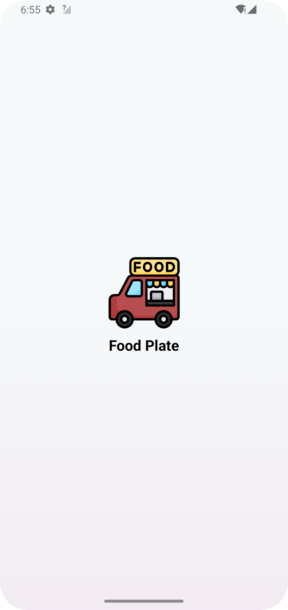
  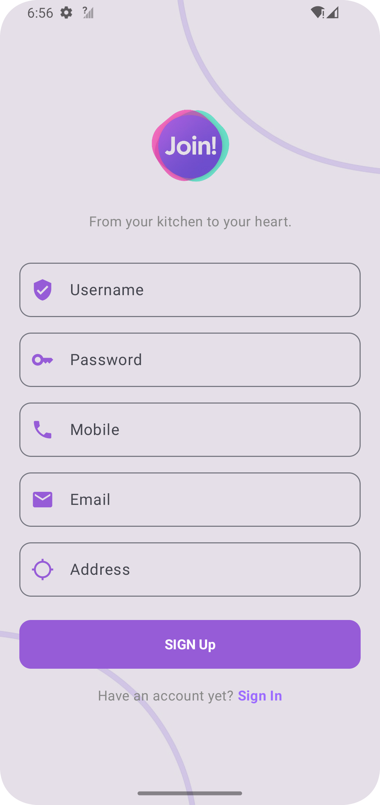
  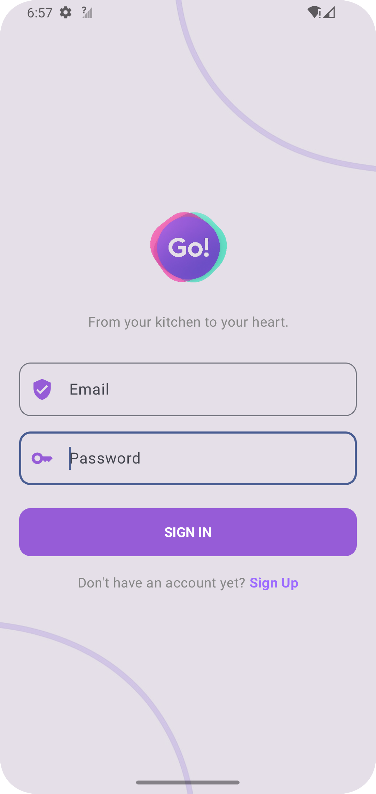
  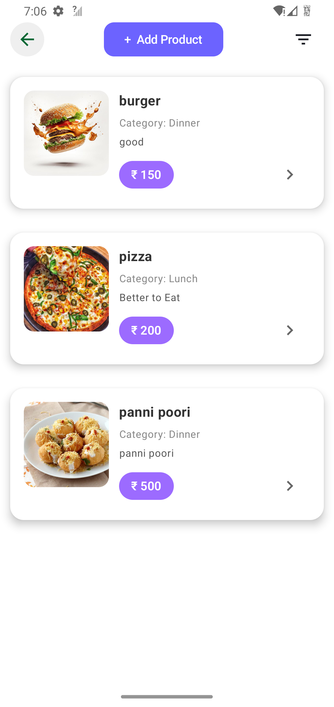
  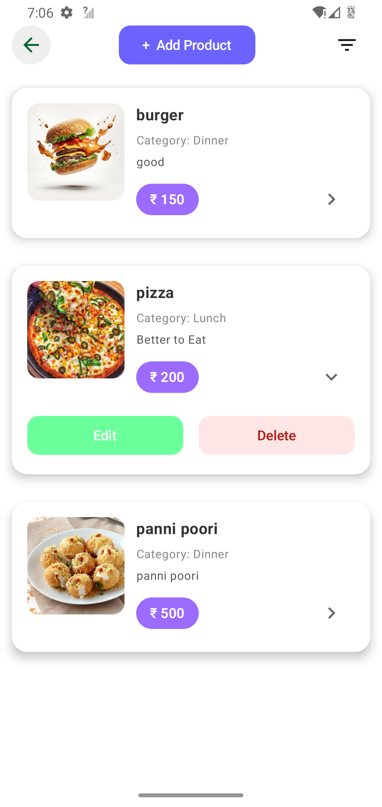
  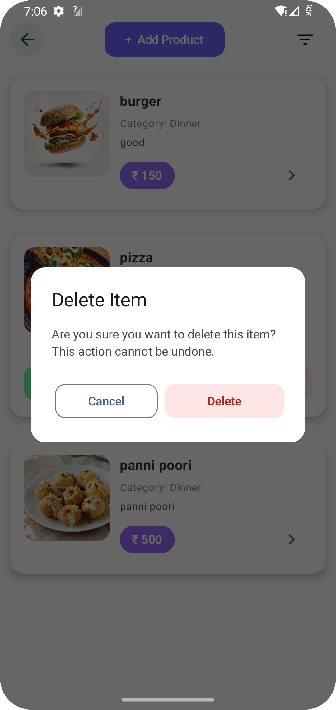
  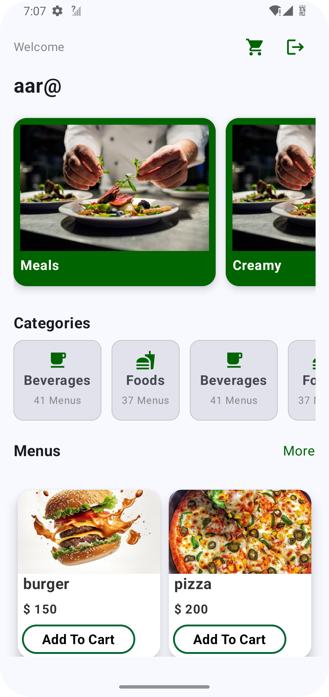
  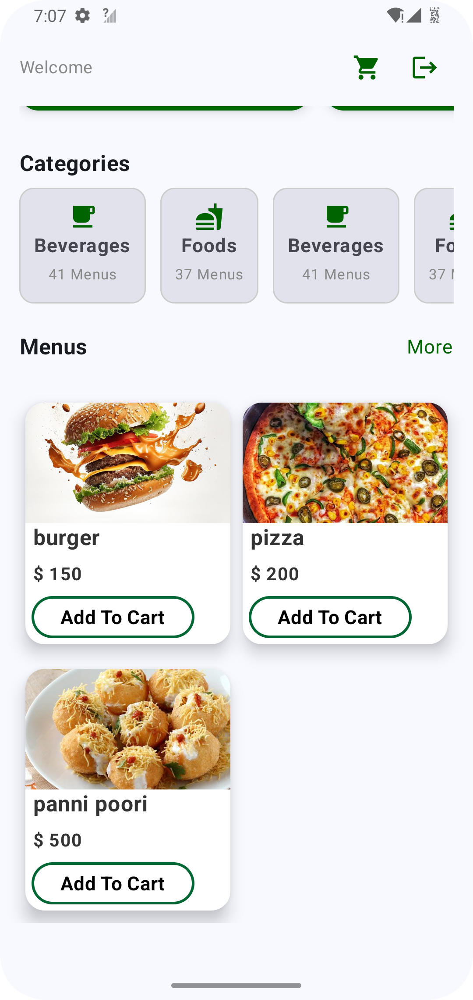
  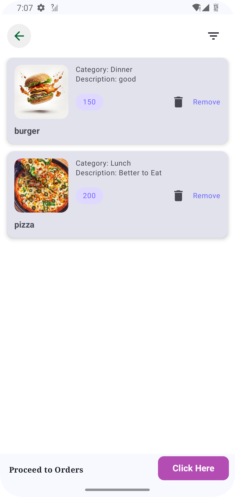
  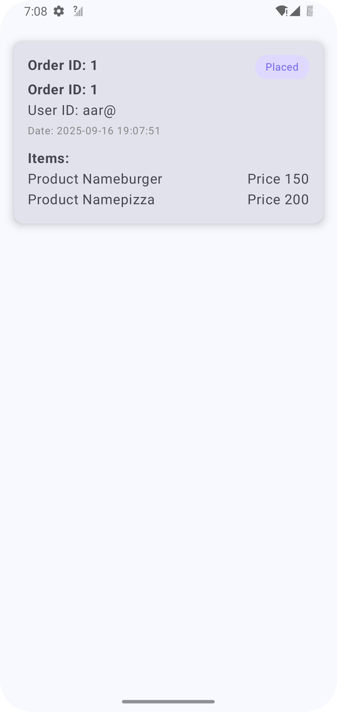
  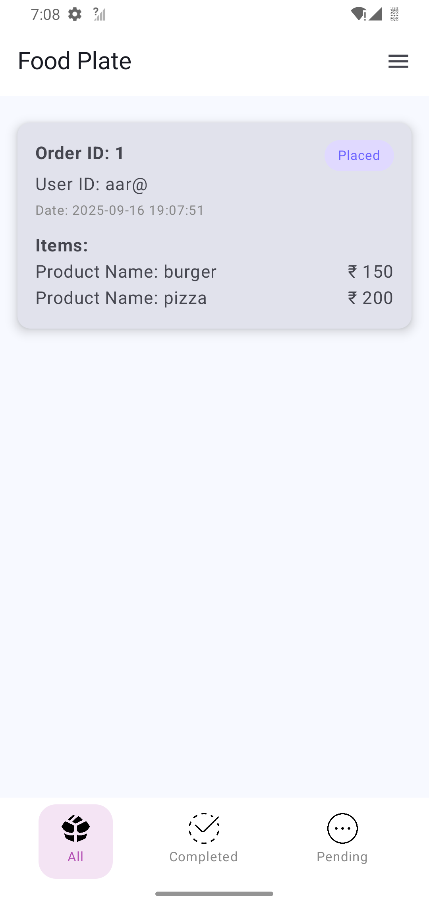
  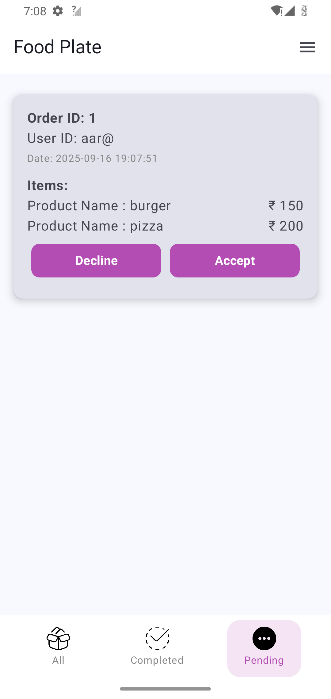
  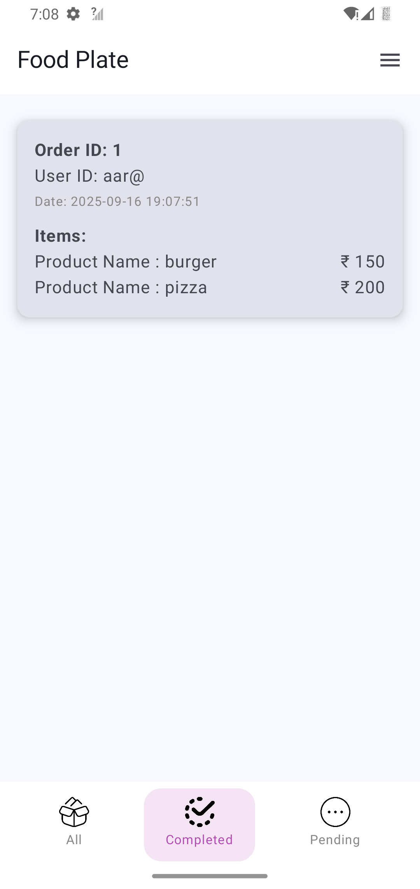
  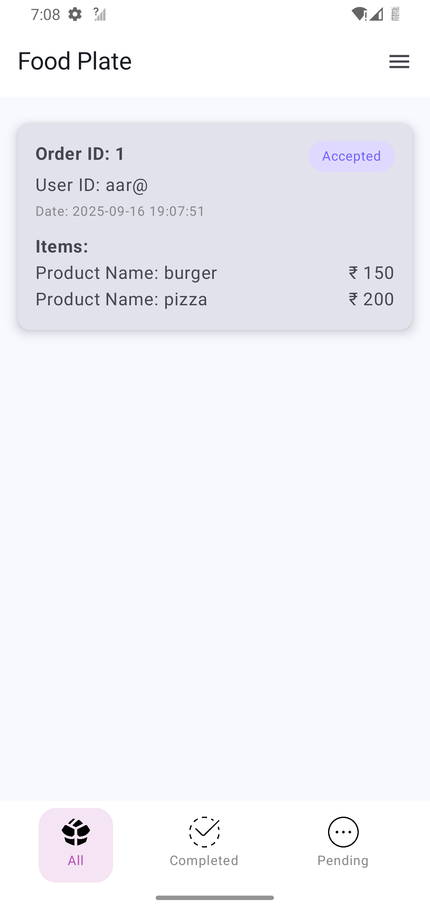
  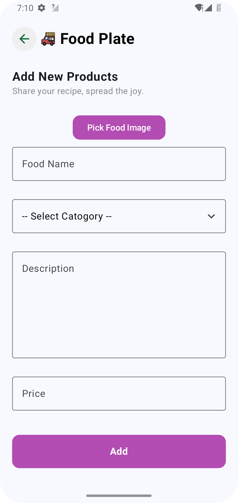
  

---

## 🚀 Installation (APK)

1. Generate the APK file from this repository
2. Install it on your Android device
3. Open the app and start browsing the menu & placing orders

---

## 🔒 Source Code

⚠️ The source code for this project is private.

This repository is intended to **showcase the app’s functionality**.
Contact me if you want access or collaboration.

---

## 🌐 Connect With Me

* LinkedIn: (your link)
* Email: (your email)

---

## 💡 Future Improvements

* ☁️ Integrate with cloud backend for real-time orders
* 🏷️ Add categories and search functionality
* 📤 Implement order history & receipts
* 🎨 Enhance UI with animations

---

## ⭐ Support

If you like this project, give it a ⭐ on GitHub!
